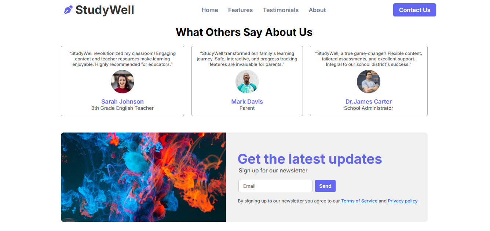

# 🚀 StudyWell - Smart Learning Platform
StudyWell is an intuitive and modern smart learning platform designed to make education engaging, personalized, and accessible. It offers interactive lessons, progress tracking to help learners study smarter, not harder.

## 🛠 Technologies Used
- HTML
- CSS
- Javascript
- Web3Forms
- Remix Icon


## 📸 Screenshots

| Home page |
|-----------|
|  |

 Features Page |
|--------------|
|  |

| Contact page |
|--------------|
|  |

---
## 🚀 How to Run the Project

```bash
# 1. Clone the repository
git clone https://github.com/ankittripathe/StudyWell.git
cd StudyWell

# 2. Run this Project
right click open with live server
```

## 🔗 Links
- 🌐 **Live Demo**: [https://lnkd.in/drtsgfVk](https://studywell-webapp.netlify.app/)
- 📁 **GitHub Repo**: [https://lnkd.in/g-m6hC2Y](https://github.com/ankittripathe/StudyWell)

## 🤝 Let's Connect
If you're passionate about frontend development, UI/UX, or React-based web apps — let’s connect and collaborate!

[](https://www.linkedin.com/in/ankittripathe)

[](https://github.com/ankittripathe)

[](mailto:ankittripathe@gmail.com)


## 🌐 Check Out My Portfolio
[](https://ankittripathi.vercel.app/)
